# 第一章 VirtualBox的配置与使用

## 实验目的

- 熟悉基于 OpenWrt 的无线接入点（AP）配置
- 为第二章、第三章和第四章实验准备好「无线软 AP」环境

---

## 实验环境

- 可以开启监听模式、AP 模式和数据帧注入功能的 USB 无线网卡
- Virtualbox

---

## 实验要求

- [x] 对照第一章实验 `无线路由器/无线接入点（AP）配置` 列的功能清单，找到在 `OpenWrt` 中的配置界面并截图证明
- [x] 记录环境搭建步骤
- [x] 如果 USB 无线网卡能在 `OpenWrt` 中正常工作，则截图证明

---

## 实验过程

### 无线路由器/无线接入点（AP）配置

- 网卡图片如下

    

- 网卡配置如下

    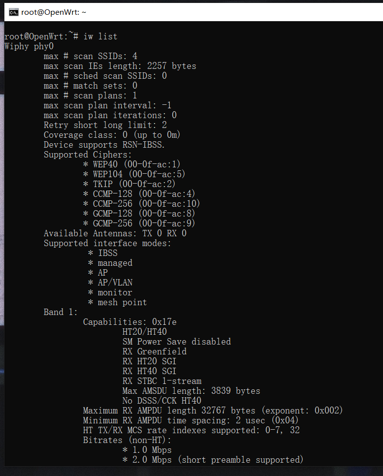

    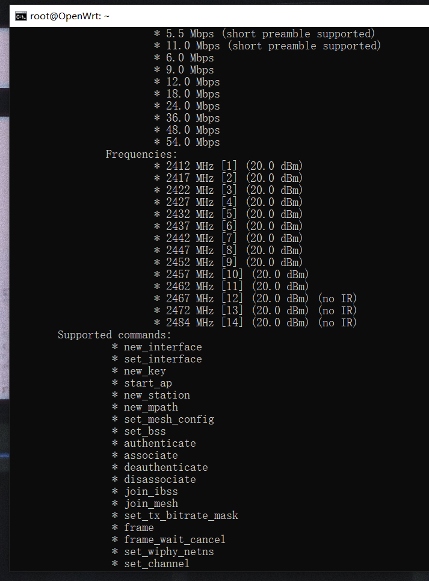

    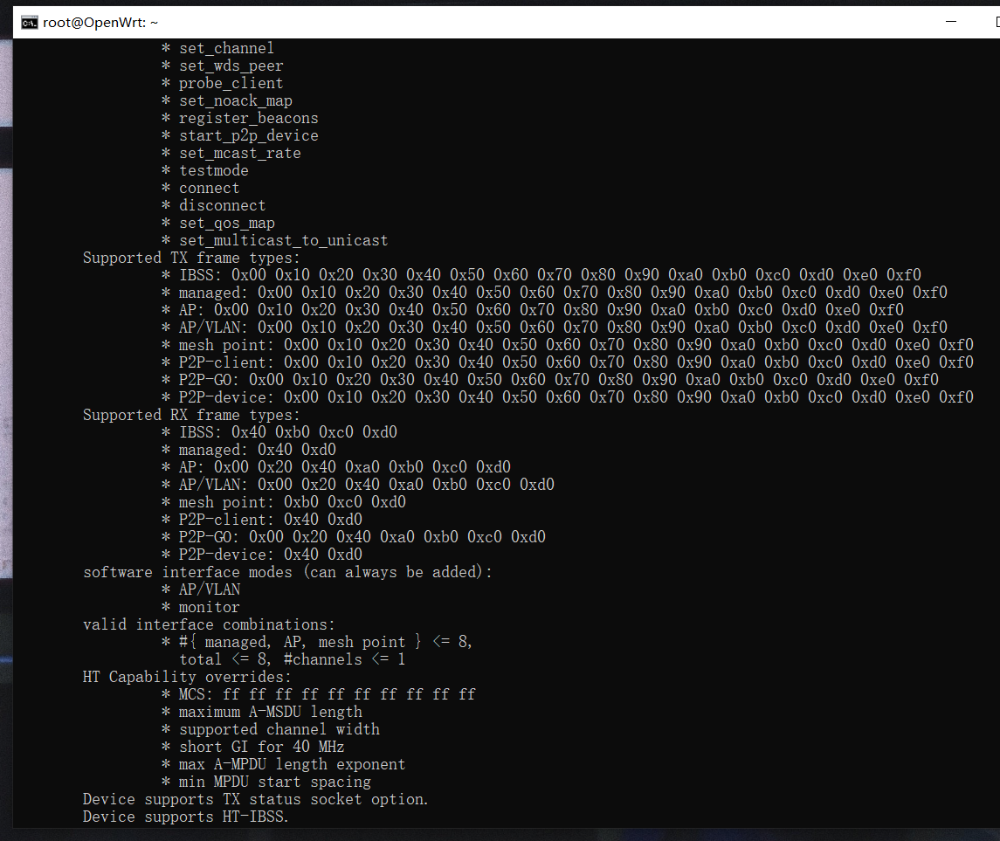

    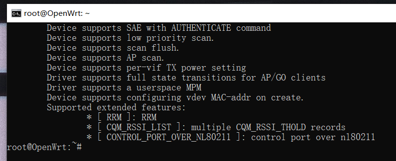

---

### OpenWrt on VirtualBox环境搭建

-   ```bash
    # 下载镜像文件
    wget https://downloads.openwrt.org/releases/19.07.5/targets/x86/64/openwrt-x86-64-combined-squashfs.img.gz
    # 手动下载路径如下图所示
    ```
    
    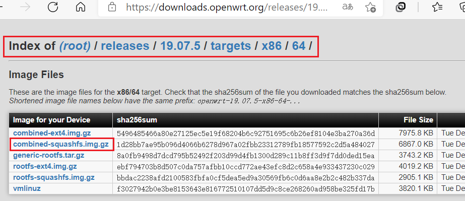

- 下载文件如图所示

    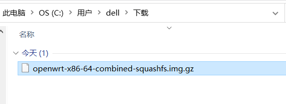

-   ```bash
    # 用git bash进行解压缩
    gunzip openwrt-x86-64-combined-squashfs.img.gz
    ```

    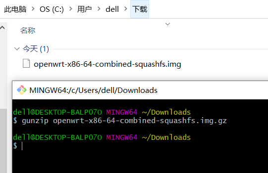

-   ```bash
    # img 格式转换为 Virtualbox 虚拟硬盘格式 vdi
    VBoxManage convertfromraw --format VDI openwrt-x86-64-combined-squashfs.img openwrt-x86-64-combined-squashfs.vdi
    # 新建虚拟机选择「类型」 Linux / 「版本」Linux 2.6 / 3.x / 4.x (64-bit)，填写有意义的虚拟机「名称」
    # 内存设置为 256 MB
    # 使用已有的虚拟硬盘文件 - 「注册」新虚拟硬盘文件选择刚才转换生成的 .vdi 文件
    ```

- 使用`VBoxManage`时报错
    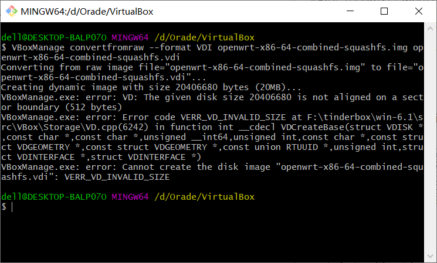
- 根据官网提供方法进行`dd`
    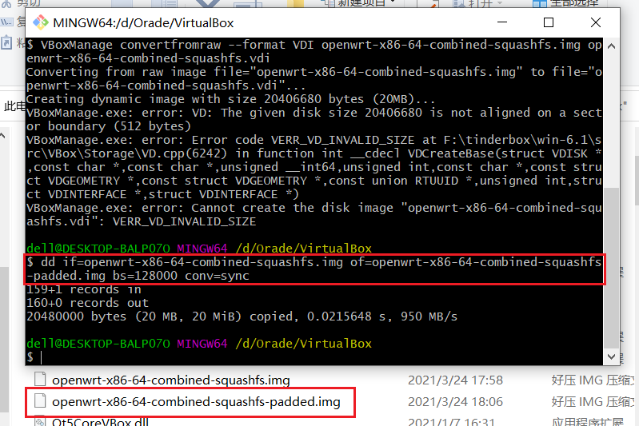
- 再次使用`VBoxManage`成功
    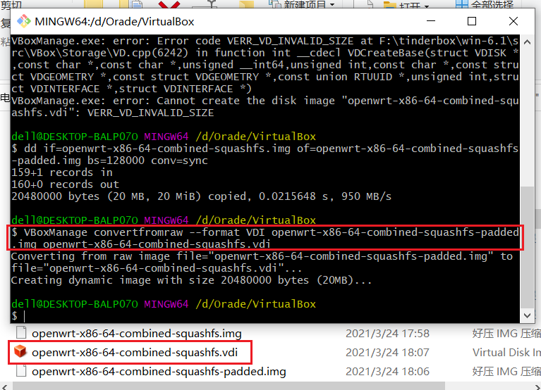


- 虚拟机安装成功，将第一块网卡设置为：Intel PRO/1000 MT 桌面（仅主机(Host-Only)网络）；第二块网卡设置为：Intel PRO/1000 MT 桌面（网络地址转换(NAT)）
    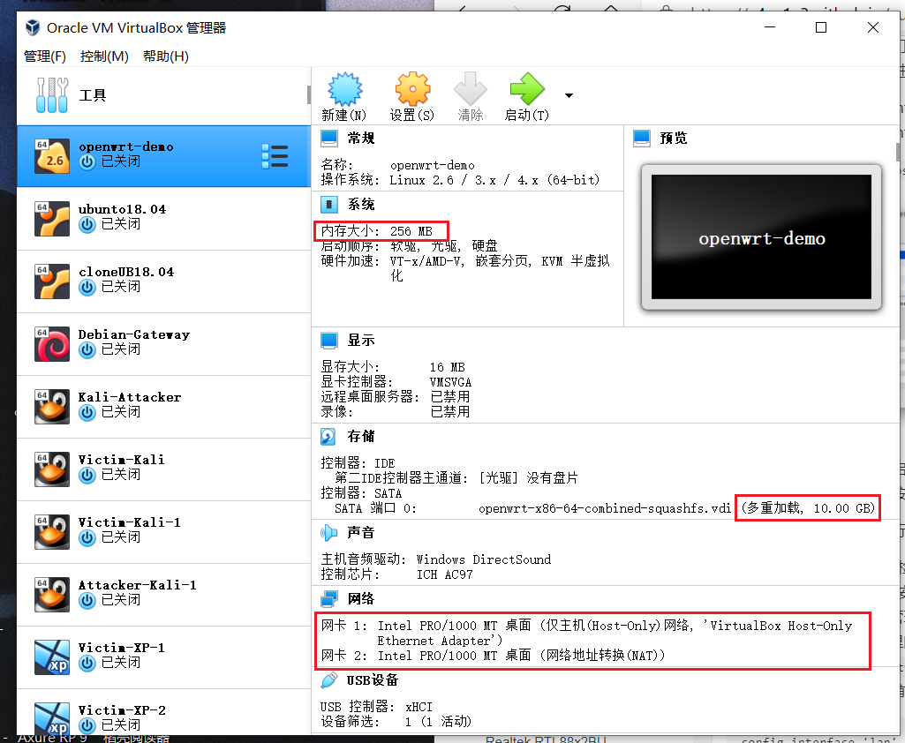

- 启动虚拟机后，修改`/etc/config/network`

    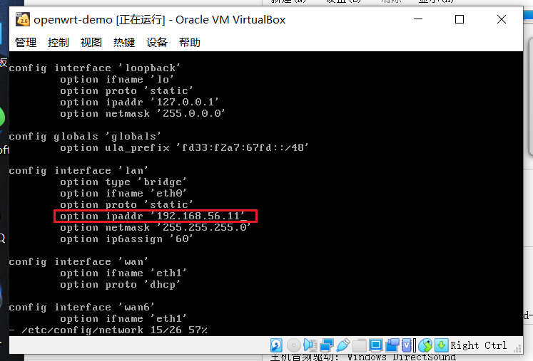

- 修改完成后重新加载指定网卡

    ```bash
    # 网卡重新加载使配置生效
    ifdown eth0 && ifup eth0
    # 查看网卡
    ip a
    ```

    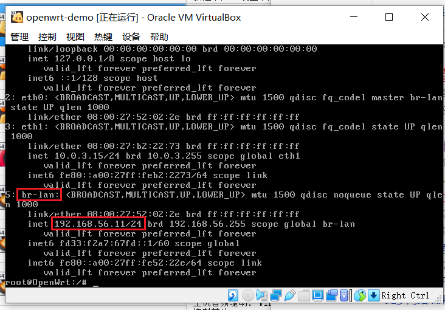

- 通过 `OpenWrt` 的软件包管理器 `opkg` 进行联网安装软件

    ```bash
    # 更新 opkg 本地缓存
    opkg update

    # 检索指定软件包
    opkg find luci
    # luci - git-19.223.33685-f929298-1

    # 查看 luci 依赖的软件包有哪些 
    opkg depends luci
    # luci depends on:
    #     libc
    #     uhttpd
    #     uhttpd-mod-ubus
    #     luci-mod-admin-full
    #     luci-theme-bootstrap
    #     luci-app-firewall
    #     luci-proto-ppp
    #     libiwinfo-lua
    #     luci-proto-ipv6

    # 查看系统中已安装软件包
    opkg list-installed

    # 安装 luci
    opkg install luci

    # 查看 luci-mod-admin-full 在系统上释放的文件有哪些
    opkg files luci-mod-admin-full
    # Package luci-mod-admin-full (git-16.018.33482-3201903-1) is installed on root and has the following files:
    # /usr/lib/lua/luci/view/admin_network/wifi_status.htm
    # /usr/lib/lua/luci/view/admin_system/packages.htm
    # /usr/lib/lua/luci/model/cbi/admin_status/processes.lua
    # /www/luci-static/resources/wireless.svg
    # /usr/lib/lua/luci/model/cbi/admin_system/system.
    # ...
    # /usr/lib/lua/luci/view/admin_network/iface_status.htm
    # /usr/lib/lua/luci/view/admin_uci/revert.htm
    # /usr/lib/lua/luci/model/cbi/admin_network/proto_ahcp.lua
    # /usr/lib/lua/luci/view/admin_uci/changelog.htm
    ```

- 以下是安装好 `luci` 后通过浏览器访问管理 `OpenWrt` 的效果截图。首次不需要密码直接可登录。

    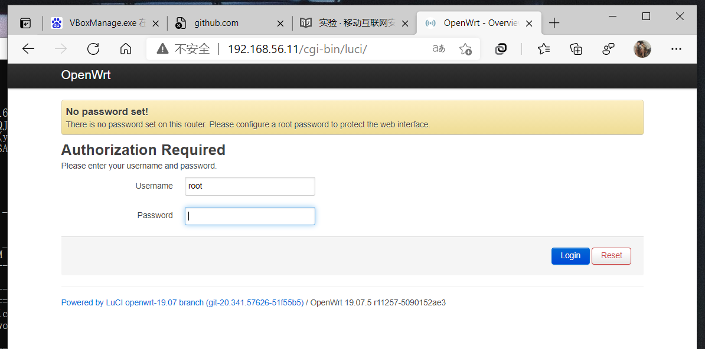

- 此外可以配置 `SSH` 连接

    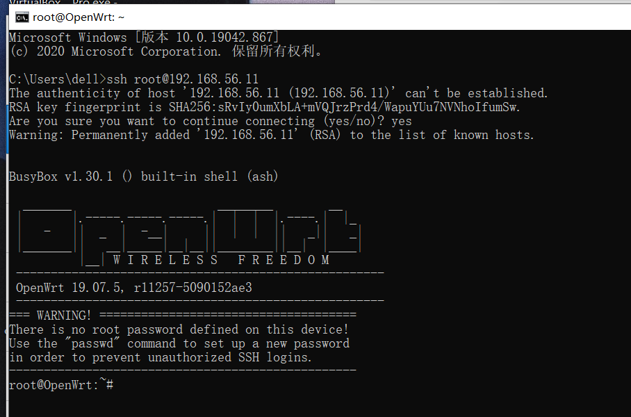

---

### 开启 AP 功能

- 当前待接入 USB 无线网卡的芯片信息可以通过在 Kali 虚拟机中使用 `lsusb` 的方式查看，但默认情况下 OpenWrt 并没有安装对应的软件包，需要通过如下 `opkg` 命令完成软件安装。

    ```bash
    # 每次重启 OpenWRT 之后，安装软件包或使用搜索命令之前均需要执行一次 opkg update
    opkg update && opkg install usbutils
    ```

    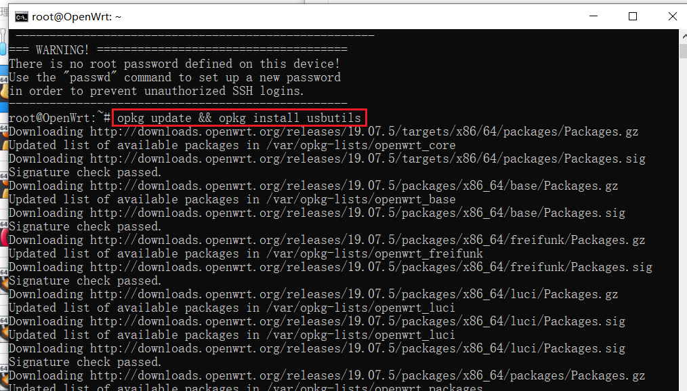

- 安装好 `usbutils` 之后，通过以下 2 个步骤可以确定该无线网卡的驱动是否已经安装好。

    ```bash
    # 查看 USB 外设的标识信息
    lsusb
    # 查看 USB 外设的驱动加载情况
    lsusb -t

    # 若驱动未加载，则下载驱动
    # opkg find 命令可以快速查找可能包含指定芯片名称的驱动程序包
    opkg find kmod-* | grep 2870
    # 下载对应驱动
    opkg install kmod-rt2800-usb
    ```

    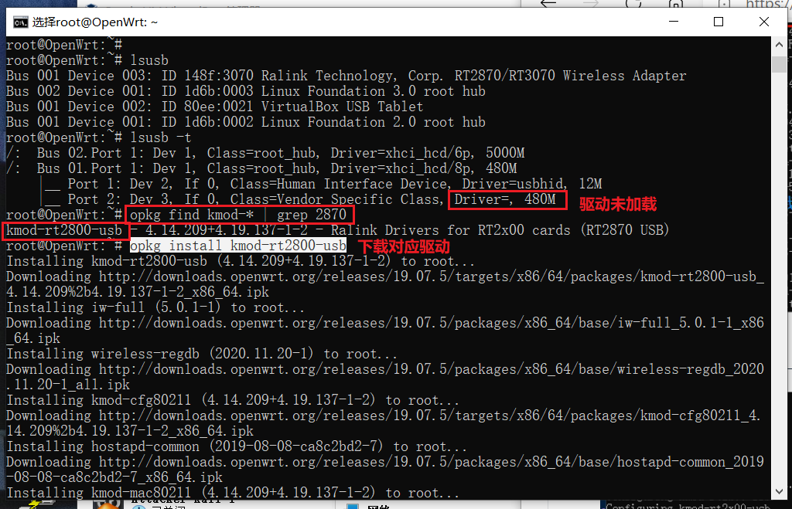

- 驱动安装成功

    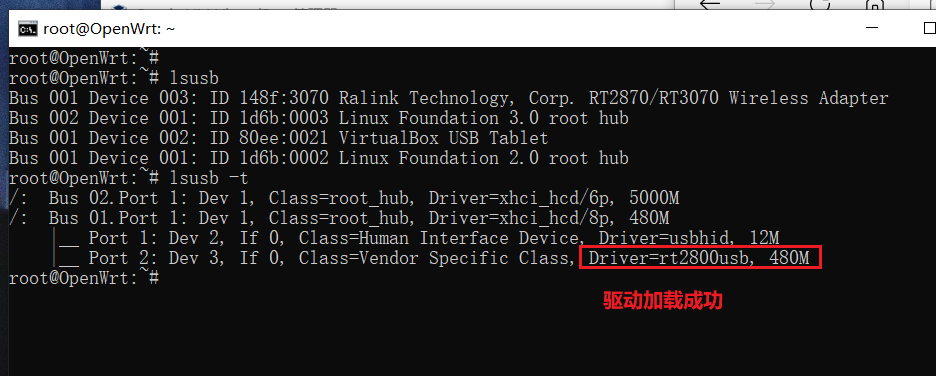

- 默认情况下，OpenWrt 只支持 `WEP` 系列过时的无线安全机制。为了让 OpenWrt 支持 `WPA` 系列更安全的无线安全机制，还需要额外安装 2 个软件包：`wpa-supplicant` 和 `hostapd` 。其中 `wpa-supplicant` 提供 WPA 客户端认证，`hostapd` 提供 AP 或 ad-hoc 模式的 WPA 认证。

    ```bash
    opkg install hostapd wpa-supplicant
    ```

- 成功加载网卡驱动后，登入 `LuCi` 之后在顶部菜单 `Network` 里即可发现新增了一个菜单项 `Wireless`

    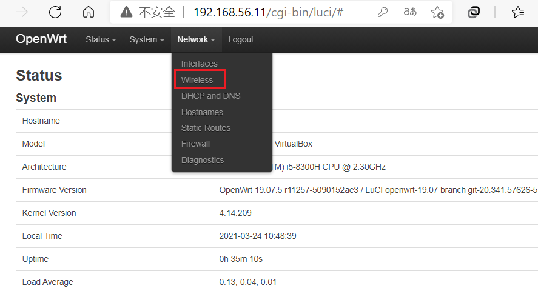

- 配置无线网卡时，不要使用 Auto 模式的信道选择和信号强度，均手工指定才可以。如下图所示为手工指定监听信道和信号强度的示例：

    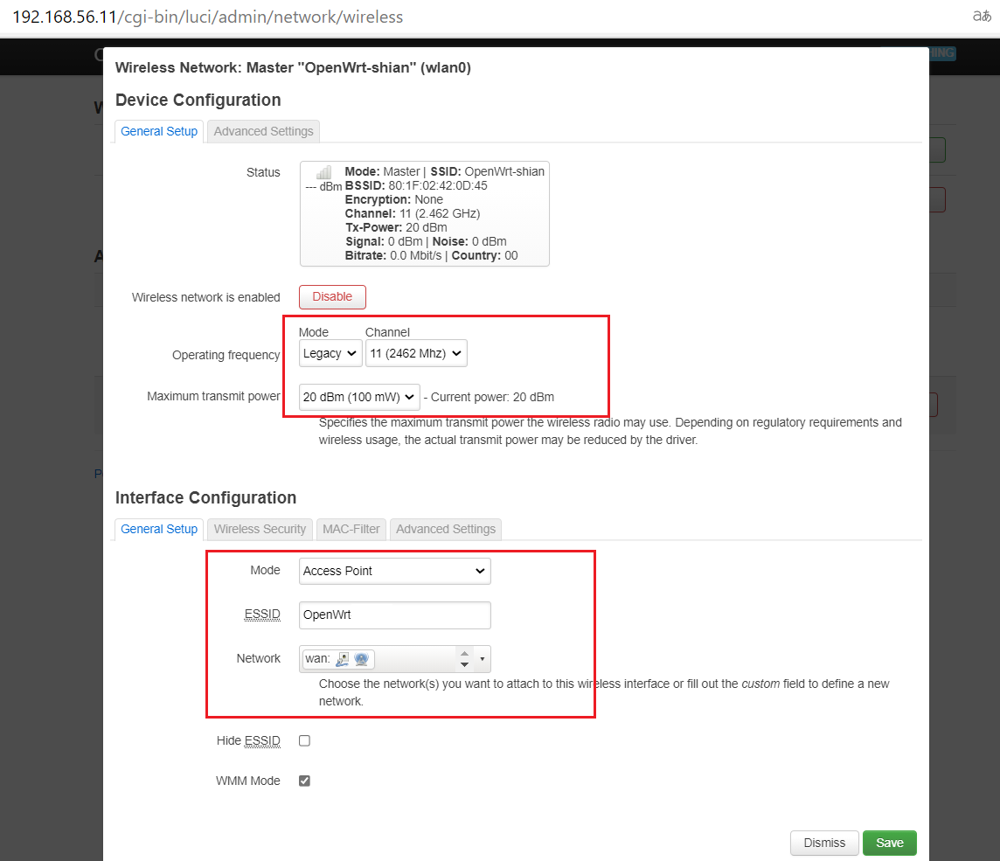

- 经过过多次重启，配置成功。下图是无设备连接情况：

    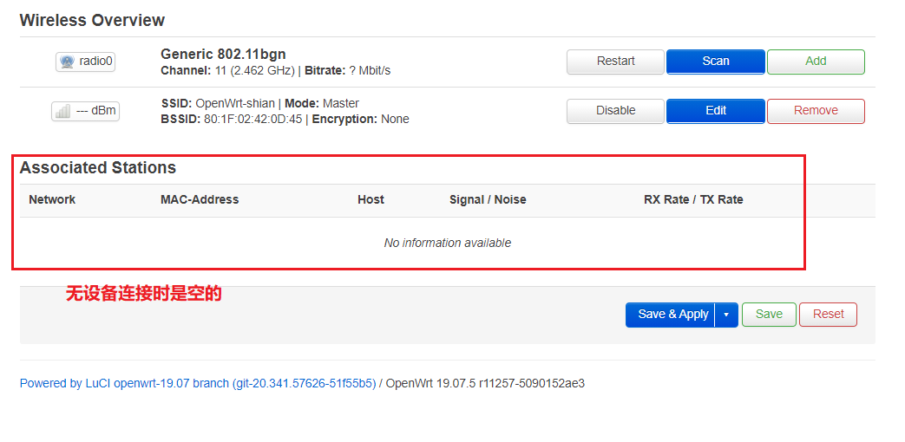

- 一台设备连接情况：

    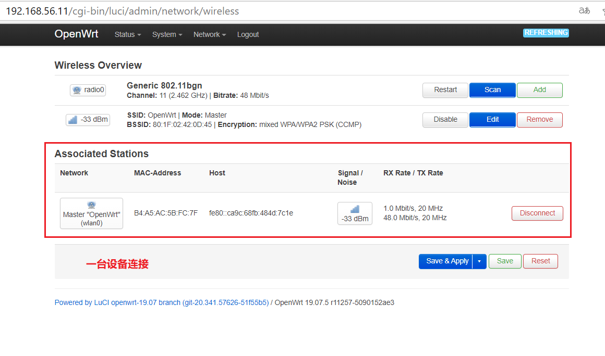

- 通过该网卡扫描周围的wifi情况：

    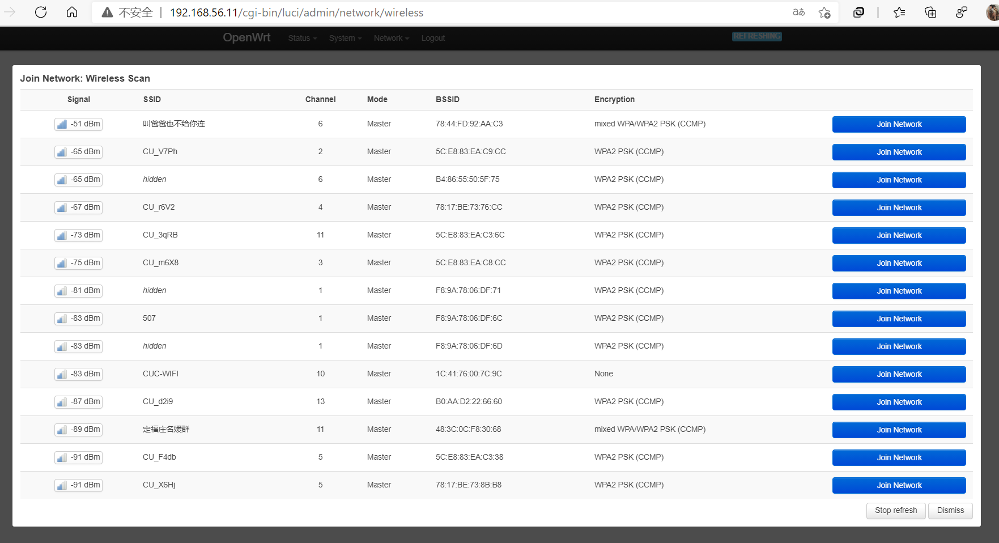

---

## 实验问题

- `VBoxManage` 需要添加到系统路径才能在命令行里使用，但是命令行没有 `dd` 指令，所以选择用 `git bash` 进行 `vdi` 转换；而 `git bash` 没有 `VBoxManage` 指令，所以需要在 `VBoxManage.exe` 所在目录下打开 `git bash` 进行 `vdi` 转换

- `vdi` 需要扩容，并改成多重加载

- 开启AP功能时，驱动已正确加载，配置也手动选择，但是网卡一直处于 `disable` 状态。
    - 解决办法：重启！！！

- 网卡正常启动，手机也能扫描到自建的无线网络，但是连接不上。
    - 解决办法：重启！！！

## 参考资料

- [课本第一章实验](https://c4pr1c3.github.io/cuc-mis/chap0x01/exp.html)