# 第五章 Android Studio模拟器环境搭建实验报告

## 实验要求

- [x] 安装和配置 Java SDK
- [x] 安装Android Studio
- [x] 下载安装 Android SDK
- [x] 配置 Android 模拟器运行环境
- [x] 配置 Gradle 编译环境

## 实验环境

- Windows 10

- Android Studio 4.1

## 实验过程
### 安装和配置 Java SDK

- 参考 Java 官方的版本支持计划，首选 LTS（长期支持，Long-Term-Support ）版本，确保可获得足够长时间的官方维护和更新支持。
    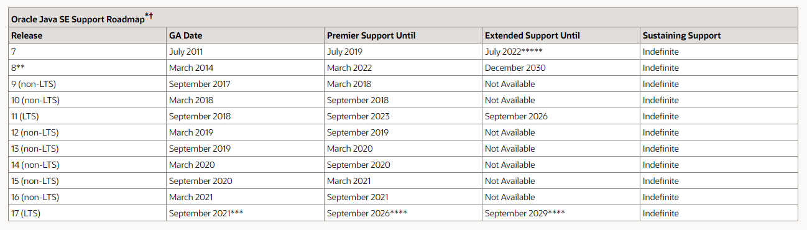

- 所以选择版本11

---

### 安装Android Studio

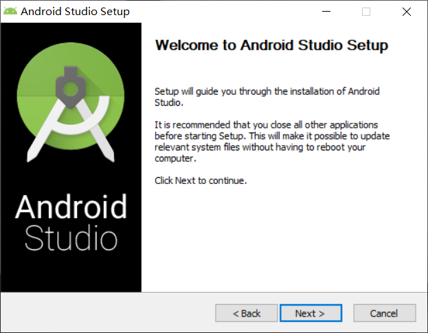

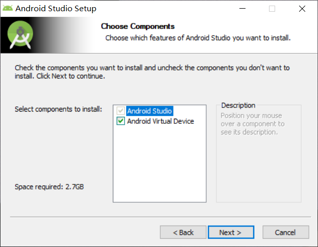

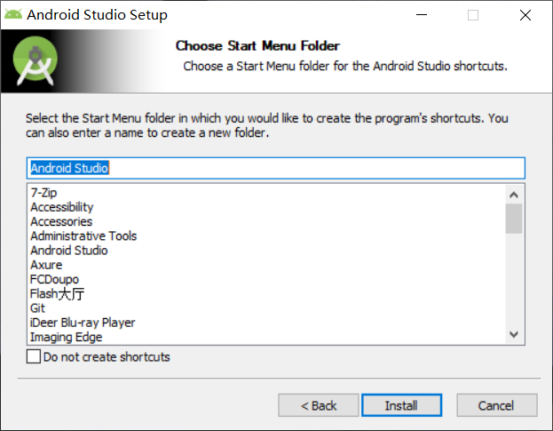

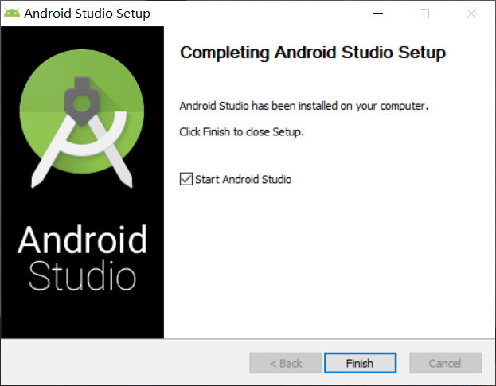

---

### 下载安装 Android SDK

- Android Studio首次启动报错

    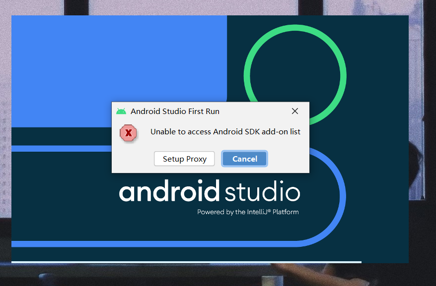

- 点击取消后进入SDK下载界面，按步骤下载

    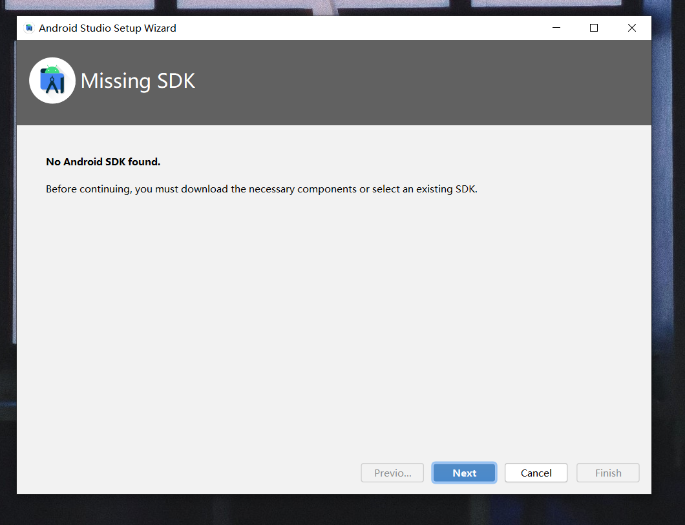

    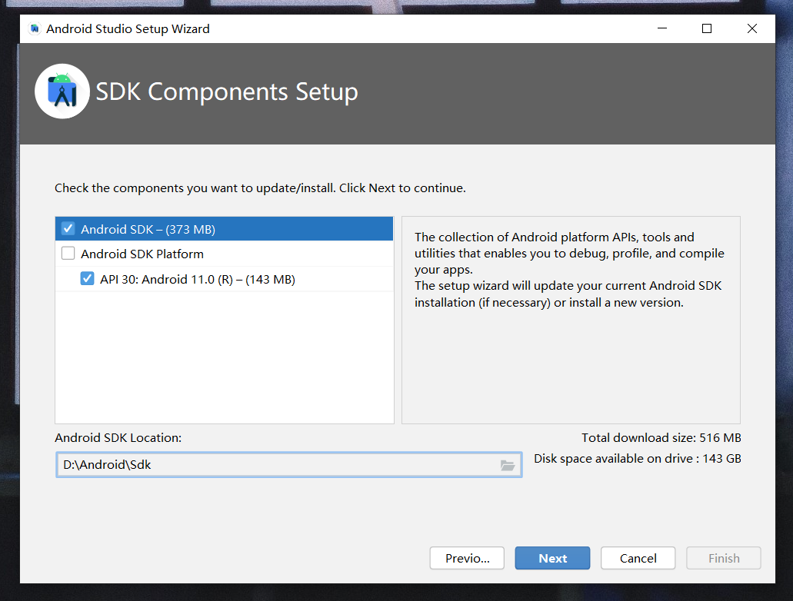

    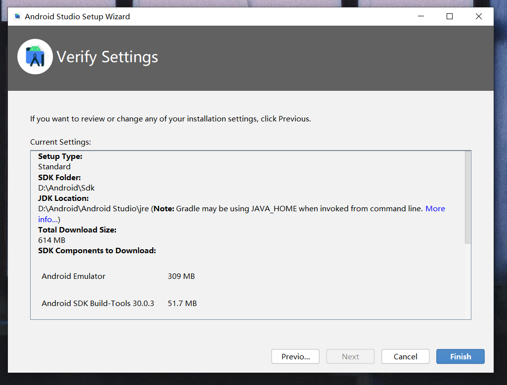

    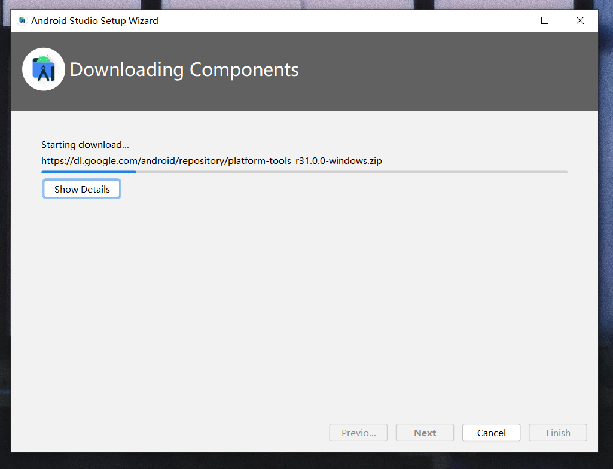

- SDK下载完成后显示初始界面

    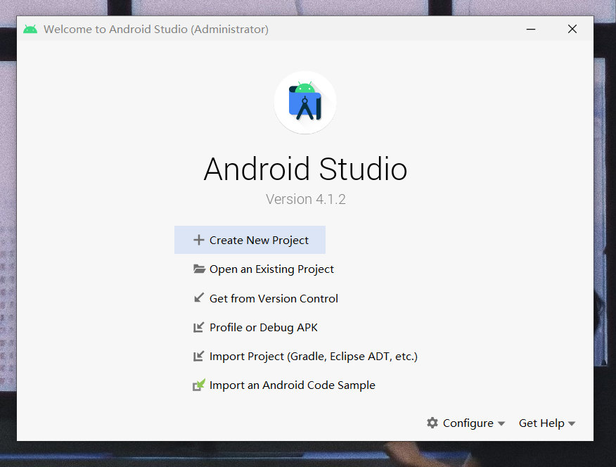

- 显示已下载`Android 11`

    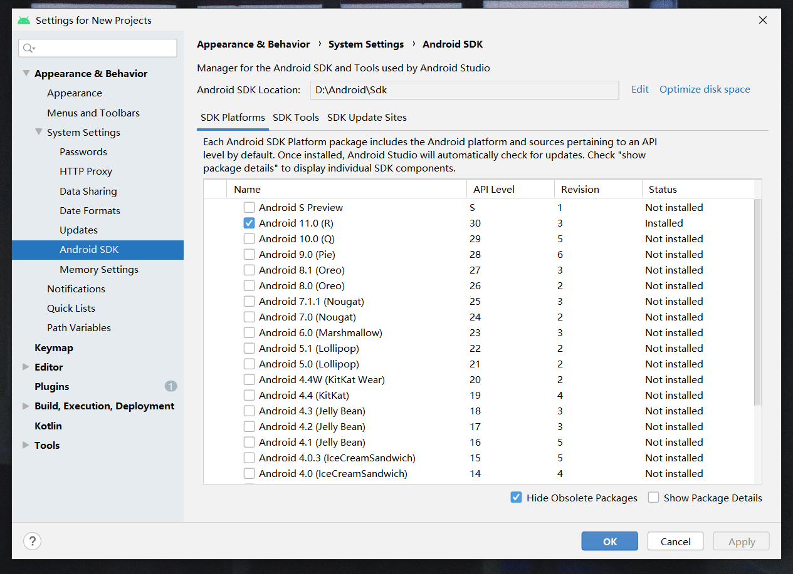

---

### 配置 Android 模拟器运行环境

- 找到`SDK Tools`界面，下载安装 `Intel x86 Emulator Accelerator (HAXM installer)`

    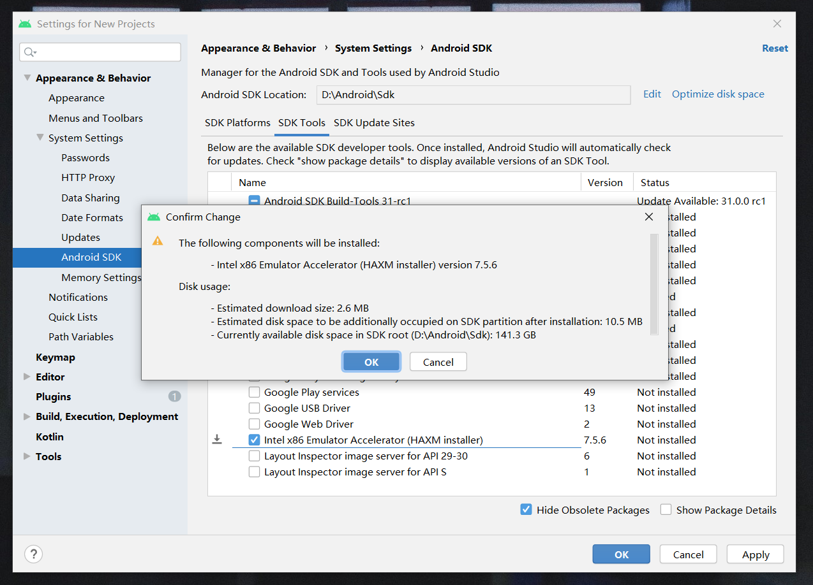

- 安装完成

    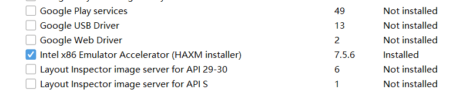

---

### 配置 Gradle 编译环境

- 从官网下载Gradle，版本6.8.3

- 配置Gradle的环境变量到系统`Path`中

- 运行命令：`gradle -v` 查看Gradle版本号是否安装成功

    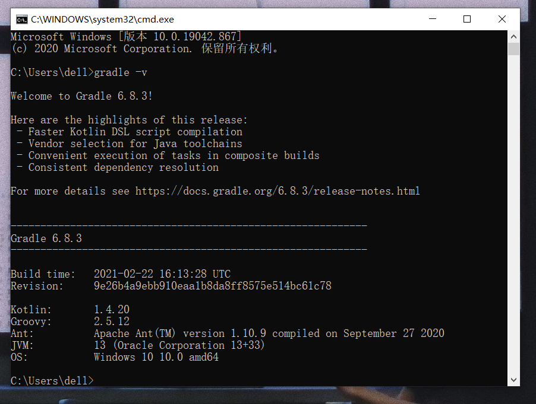

---

## 参考资料

- [移动互联网安全第五章实验指导]([imgs/5.1gradle.PNG](https://c4pr1c3.github.io/cuc-mis/chap0x05/exp.html))

- [简单介绍Gradle编译环境](https://blog.csdn.net/yang542397/article/details/79780587)
