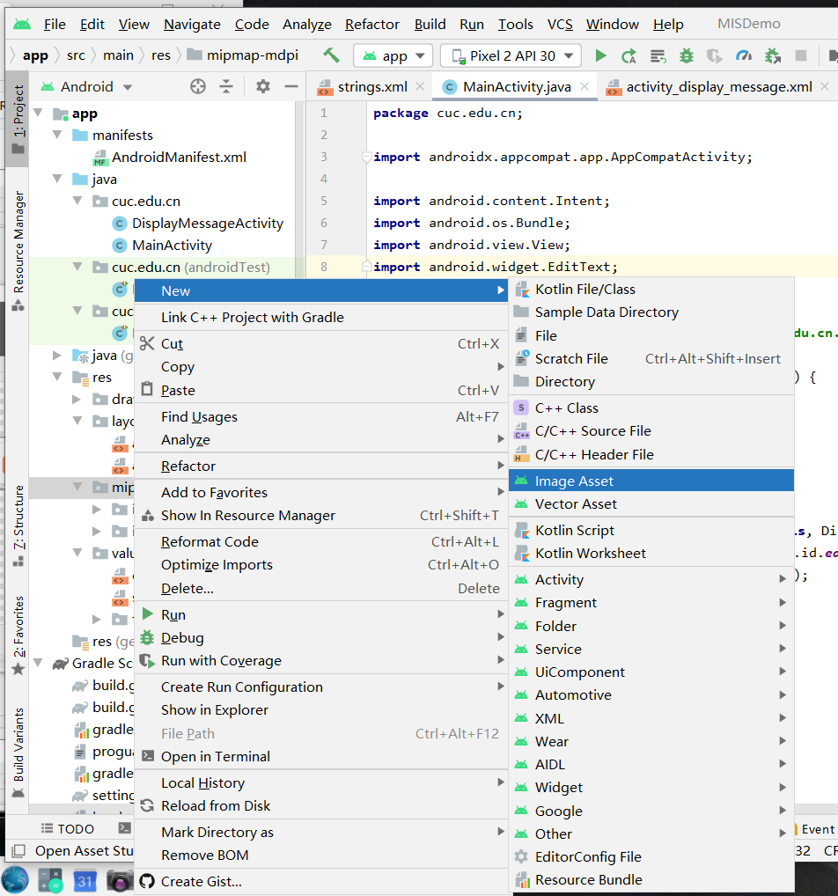

# 实验六 安卓系统访问控制策略与机制

## 实验环境

- Android Studio 4.1

- Android 11.0 API 30 x86 - Pixel 2

    

## 实验过程

### ADB实验

#### 命令行

```bash
# 查看开启的模拟器
adb devices

# 连接模拟器终端
adb -s emulator-5554 shell

# 输出环境变量
echo $PATH

# 查看系统版本，lsb_release -a 不可用
uname -a

# 查看当前目录下文件
ls

# 查看防火墙规则
iptables -nL
```


```bash
# 将文件复制到设备
#adb pull remote local
adb pull ./system/app/EasterEgg/EasterEgg.apk

# 从设备复制文件
#adb push local remote
adb push text.txt /sdcard/
```


```bash
# 安装应用
adb install path_to_apk
```

#### Activity Manager (am)

```bash
# Camera（照相机）的启动方法为:
am start -n com.android.camera/com.android.camera.Camera

# Browser（浏览器）的启动方法为：
am start -n com.android.browser/com.android.browser.BrowserActivity

# 启动浏览器 :
am start -a android.intent.action.VIEW -d  http://sec.cuc.edu.cn/

# 拨打电话 :
am start -a android.intent.action.CALL -d tel:10086

# 发短信：
adb shell am start -a android.intent.action.SENDTO -d sms:10086 --es sms_body ye --ez exit_on_sent true
```

#### 软件包管理器 (pm)

```bash
# 查看第三方软件包
pm list packages -3

# 卸载指定软件包
pm uninstall PACKAGE_NAME
```


#### 其他adb实验

```bash
# 常用的按键对应的KEY_CODE
adb shell input keyevent 22 //焦点去到发送键
adb shell input keyevent 66 //回车按下

adb shell input keyevent 4 // 物理返回键
adb shell input keyevent 3 // 物理HOME键
```

---

### Hello World v1

#### 构建第一个 Android 应用

- 根据 [Android - FirstApp](https://developer.android.google.cn/training/basics/firstapp) 给出的指示一步一步进行操作。

- 呈现效果：

    

    


#### 问题回答

**按照向导创建的工程在模拟器里运行成功的前提下，生成的APK文件在哪儿保存的？**

- APK文件应该在 `\MISDemo\app\build` 目录下

    

    

**使用adb shell是否可以绕过MainActivity页面直接“唤起”第二个DisplayMessageActivity页面？是否可以在直接唤起的这个DisplayMessageActivity页面上显示自定义的一段文字，比如：你好移动互联网安全**

- 可以

    ```bash
    adb -s emulator-5554 shell am start -n cuc.edu.cn/cuc.edu.cn.DisplayMessageActivity --es "cuc.edu.cn.MESSAGE" "你好移动互联网安全"
    ```

**如何实现在真机上运行你开发的这个Hello World程序？**

- 将 `APK` 复制到真机中，然后通过 `pm` 安装

- 直接将本地 `APK` 安装到真机中

**如何修改代码实现通过 `adb shell am start -a android.intent.action.VIEW -d http://sec.cuc.edu.cn/` 可以让我们的cuc.edu.cn.misdemo程序出现在“用于打开浏览器的应用程序选择列表”？**

- app > manifests > AndroidManifest.xml

- 添加如下代码

    ```bash
    // AndroidManifest.xml  <activity android:name=".MainActivity">
    <action android:name="android.intent.action.VIEW" />
    <category android:name="android.intent.category.DEFAULT" />
    <category android:name="android.intent.category.BROWSABLE" />
    <data android:scheme="http" />
    <data android:scheme="https" />
    ```

**如何修改应用程序默认图标？**

- `Project` > `app` > `res` > `mipmap` > `New Image Assert`

    

    

    

**如何修改代码使得应用程序图标在手机主屏幕上实现隐藏？**

- `app` > `res` > `MainActivity.java`

- 添加如下代码

    ```bash
    // MainActivity.java onCreate
    PackageManager packageManager = getPackageManager();
    ComponentName componentName = new ComponentName(MainActivity.this, MainActivity.class);
    packageManager.setComponentEnabledSetting(componentName,
            PackageManager.COMPONENT_ENABLED_STATE_DISABLED, PackageManager.DONT_KILL_APP);
    ```


## 实验问题

- 只是简单实现了一个Android应用

## 参考资料

- [第六章实验](https://c4pr1c3.github.io/cuc-mis/chap0x06/exp.html#hello-world-v1)

- [移动互联网安全（2021）](https://www.bilibili.com/video/BV1rr4y1A7nz?p=100)