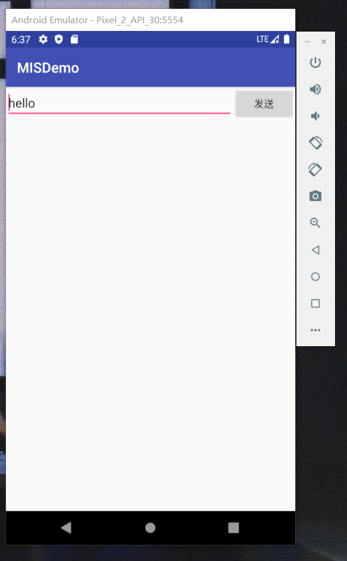

# 实验七 软件逆向系列实验

## 实验目的

- 初步认识Android平台逆向工程

## 实验环境

- Android Studio 4.2

- Android 11.0 API 30 x86 - Pixel 2

## 实验过程

### smali代码分析

1. 检出[Deliberately Vulnerable Android Hello World](https://github.com/c4pr1c3/DVAHW)最新版代码，在Android Studio中导入该项目；

2. `Build` -> `Generate Signed Bundle/APK...`，生成的发布版apk文件位于项目根目录下相对路径：`app/app-release.apk`；

3. 使用`VSCode`的`APKLab`对`apk`文件进行反编译，反编译过程的输出信息如下，反编译成功后，会在当前目录下生成apk文件名命名的一个独立目录。

    ```bash
    # 在app-release.apk文件所在目录执行如下命令
    # 确认 apktool 在系统 PATH 环境变量中可找到
    apktool d app-release.apk 
    ```

    

4. 反汇编出来的`smali`代码位于apktool输出目录下的 **smali** 子目录，源代码目录中的 **res** 目录也位于输出目录的一级子目录下。

    

    如上图所示，是[Deliberately Vulnerable Android Hello World](https://github.com/c4pr1c3/DVAHW)在模拟器中运行，输入注册码错误时的提示信息页面。注意到其中的提示消息内容为：**注册失败**。

5. 依据此**关键特征**，在反汇编输出目录下进行**关键字查找**，可以在 `res/values/strings.xml` 中找到该关键字的注册变量名为`register_failed`。

    ```bash
    grep '注册失败' -R . 
    # ./res/values/strings.xml:    <string name="register_failed">注册失败</string>
    ```

6. 用文本编辑器打开 `res/values/strings.xml` 查看会在上述代码行下一行发现：

    ```bash
    <string name="register_ok">注册成功</string>
    ```

7. 继续在反汇编输出目录下进行**关键字查找**：`register_ok`，可以发现

    ```bash
    ./smali/cn/edu/cuc/misdemo/R$string.smali:.field public static final register_ok:I = 0x7f0b0025
    ```

8. 现在，我们有了`register_ok`的资源唯一标识符：`0x7f0b0025`，使用该唯一标识符进行关键字查找，我们可以定位到这一段代码：

    ```bash
    ./smali/cn/edu/cuc/misdemo/DisplayMessageActivity.smali:    const v0, 0x7f060025
    ```

9. 用文本编辑器打开上述`DisplayMessageActivity.smali``，定位到包含该资源唯一标识符所在的代码行。同时打开DisplayMessageActivity.java`源代码，定位到包含`textView.setText(getString(R.string.register_ok));`的代码行，如下图所示：

    

10. 根据源代码行号和smali代码中的`.line 39`，我们可以找到Android源代码中的Java代码和Smali代码之间的对应“翻译”关系。上述smali代码注释说明如下：

    ```bash
    # 当前smali代码对应源代码的行号
    .line 39

    # 将 0x7f060025 赋值给寄存器v0
    const v0, 0x7f0b0025

    # invoke-virtual 是调用实例的虚方法（该方法不能是 private、static 或 final，也不能是构造函数）
    # 在非static方法中，p0代指this
    # 此处的实例对象是 cn.edu.cuc.misdemo.DisplayMessageActivity
    # Lcn/edu/cuc/misdemo/DisplayMessageActivity; 表示DisplayMessageActivity这个对象实例 getString是具体方法名
    # I表示参数是int类型
    # Ljava/lang/String; 表示 Java内置的String类型对象
    # 整个这一行smali代码表示的就是 调用 cn.edu.cuc.misdemo.DisplayMessageActivity对象的getString方法，传入一个整型参数值，得到String类型返回结果
    invoke-virtual {p0, v0}, Lcn/edu/cuc/misdemo/DisplayMessageActivity;->getString(I)Ljava/lang/String;

    # 将最新的 invoke-kind 的对象结果移到指定的寄存器中。该指令必须紧跟在（对象）结果不会被忽略的 invoke-kind 或 filled-new-array 之后执行，否则无效。
    # 其中 kind 典型取值如virtual、super、direct、static、interface等，详见Android开源官网的 'Dalvik 字节码' 说明文档
    move-result-object v0

    # 此处的v2赋值发生在 .line 37，需要注意的是这里的v2是一个局部变量（用v表示），并不是参数寄存器（用p表示）。
    # 当前initView()方法通过 .locals 定义了4个本地寄存器，用于保存局部变量，如下2行代码所示：
    # .method private initView()V
    #    .locals 4
    # V 表示 setText 的返回结果是 void 类型
    invoke-virtual {v2, v0}, Landroid/widget/TextView;->setText(Ljava/lang/CharSequence;)V
    ```

11. 搞懂了上述smali代码的含义之后，我们破解这个 **简单注册小程序** 的思路可以归纳如下：

    - 改变原来的注册码相等条件判断语句，对布尔类型返回结果直接 **取反**，达到：只要我们没有输入正确的验证码，就能通过验证的“破解”效果；

        - 将 `if-eqz` 修改为 `if-nez`
            

    - 在执行注册码相等条件判断语句之前，打印出用于和用户输入的注册码进行比较的“正确验证码”变量的值，借助`adb logcat`直接“偷窥”到正确的验证码；

        - 在 `invoke-virtual {v2, v3}, Ljava/lang/String;->equalsIgnoreCase(Ljava/lang/String;)Z` 代码之前增加2行打印语句

    ```bash
    # .method private initView()V
    #    .locals 5
    # 注意修改上述initView()方法下的.locals值从8到9
    const-string v4, "tag-here"
    invoke-static {v4, v1}, Landroid/util/Log;->v(Ljava/lang/String;Ljava/lang/String;)I
    ```

上述2种思路都需要直接修改smali代码，然后对反汇编目录进行**重打包**和**重签名**。

---

### 重打包

```bash
apktool b app-release
```

- 我选择了`VSCode`提供的重打包指令

    

- 重打包所放路径如下：

    

### 重签名

```bash
cd app-release/dist/
<Android SDK Path>/build-tools/<valid version code>/apksigner sign --min-sdk-version 19 --ks <path to release.keystore.jks> --out app-release-signed.apk app-release.apk
```

需要注意的是，上述重签名指令中用到的apksigner是包含在Android SDK的build-tools子目录下的，Android 7.0开始使用apksigner。7.0之前的版本，使用的Java SDK里的jarsigner。签名用到的证书文件，需要预先生成。

### 破解效果展示

- 重新安装

    

- 直接通过“取反”注册码判断逻辑修改后的APK运行和使用效果如下所示：

    

    

### 实验后思考

1. **重签名**的过程需要用到签名证书对应的私钥，所以作为应用程序的开发者，必须保护好自己的私钥，避免泄漏，可以有效杜绝 **打包党** 制作山寨应用，覆盖安装到用户手机上。作为用户，要避免从不正规应用分发渠道（论坛、软件下载站、搜索引擎搜索结果等）、小众应用市场安装应用，避免 **打包党** 制作的山寨应用抢先正版应用一步安装到你的手机上。

2. 正式对外发布的应用，一定要做好必要的代码混淆和应用加固，增加 **打包党** 、**攻击者** 逆向分析和重打包应用的难度。开发者在发布应用之前，可以用类似 **apktool** 这样的工具测试应用是否能被自动反汇编、反汇编后代码的可读性是否足够差，根据应用安全加固的需求决定是否需要进一步加强代码混淆和使用更健壮的应用防逆向加固技术保护源代码。


## 实验问题

- 在`Android Studio`中打开[Deliberately Vulnerable Android Hello World](https://github.com/c4pr1c3/DVAHW)项目时，遇到报错，一开始提示版本过低，重新安装了`Android Studio`新版本后又遇到了`JDK` , `Gradle`等诸多报错，经过一系列纠错，最后使用了`Android Gradle Plugin Version 4.2.1` , `Gradle Version 6.8` ,`JDK 11` , `Build Tools Version 30.0.3` 等设置。**对于一堆报错要一步一步耐心解决！！**

- 使用`Android Studio`导出`apk`文件时出现问题，查找网友的解决方法得到解决。

## 参考资料

- [第七章实验](https://c4pr1c3.github.io/cuc-mis/chap0x07/exp.html)

- [移动互联网安全（2021）](https://www.bilibili.com/video/BV1rr4y1A7nz?p=134)

- [AndroidStudio中打开新项目提示:This version of the Android Support plugin for IntelliJ IDEA (or Android Studio) cannot open this project, please retry with version 4.1 or newer.](https://www.cnblogs.com/badaoliumangqizhi/p/13959054.html)

- [First React Native App: Task :app:processDebugMainManifest FAILED](https://stackoverflow.com/questions/66696339/first-react-native-app-task-appprocessdebugmainmanifest-failed)

- [Java IntelliJ Gradle项目报错( Unsupported class file major version 60)解决方法](https://www.cjavapy.com/article/1935/)

- [gradle sync failed 的解决办法](https://blog.csdn.net/ls13552912394/article/details/106403383/)

- [The specified Android SDK Build Tools version (24.0.3) is ignored，解决办法](https://blog.csdn.net/m0_49255099/article/details/107855163)

- [Android Studio Gradle: Please remove usages of 'jcenter()' Maven repository from your build scripts](https://blog.csdn.net/l3142600073/article/details/117621657)

- [Configuration 'compile' is obsolete and has been replaced with 'implementati解决方案](https://blog.csdn.net/weixin_40845165/article/details/89213528)

- [关于android：Keystore文件存在但为空？](https://www.codenong.com/38591293/)

- [Android Studio 签名打包的两种方式之[Generate Signed APK...]方式](https://blog.csdn.net/mimica247706624/article/details/88086250)

- [FLUTTER打包出现EXECUTION FAILED FOR TASK ':APP:LINTVITALRELEASE'.的解决办法](https://www.freesion.com/article/443049426/)