# 实验八 Android 缺陷应用漏洞攻击实验

## 实验目的

- 理解 Android 经典的组件安全和数据安全相关代码缺陷原理和漏洞利用方法

- 掌握 Android 模拟器运行环境搭建和 `ADB` 使用

## 实验环境

- Android-InsecureBankv2

- Android Studio Arctic Fox | 2020.3.1 Beta 4

- Android 11.0 API 30 x86 - Pixel 2

- Android 11.0 API 30 x86 - Pixel 4 XL

- Python 2.7

## 实验要求

- [x] 详细记录实验环境搭建过程；

- [x] 至少完成以下实验：

    - [x] Developer Backdoor
    - [x] Insecure Logging
    - [x] Android Application patching + Weak Auth
    - [x] Exploiting Android Broadcast Receivers
    - [x] Exploiting Android Content Provider

- [x] 额外完成的实验：

    - [x] Exploiting Android Activities
    - [x] Exploiting Android Pasteboard

- [x] （可选）使用不同于 Walkthroughs 中提供的工具或方法达到相同的漏洞利用攻击效果；
    - 推荐 drozer

## 实验过程

### 搭建InsecureBankv2环境

- 使用的Python环境

    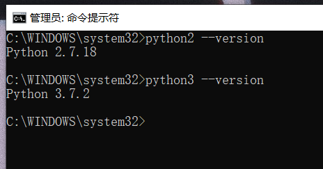

- 从[InsecureBankv2](https://github.com/c4pr1c3/Android-InsecureBankv2)下载代码

- 在 `AndroLabServer` 文件夹下安装包

    ```bash
    pipenv install -r requirements.txt --two
    #--two：在python2环境下
    pipenv shell
    pip freeze
    python2 app.py
    ```

    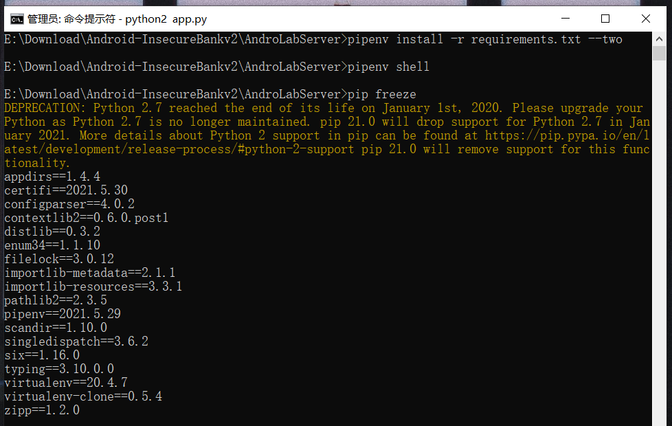

    

- 将 `Android-InsecureBankv2` 文件夹下的 `InsecureBankv2.apk` 安装进模拟器

    ```bash
    adb install InsecureBankv2.apk
    ```

    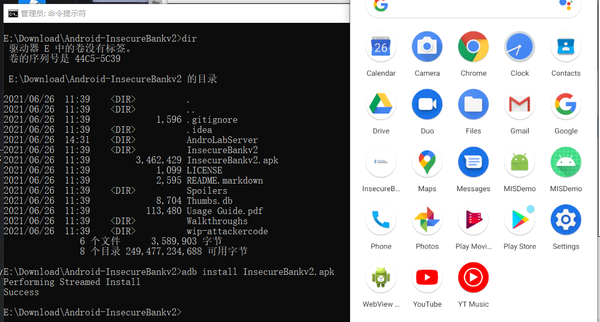

- 配置 `Preferences` ，我实验使用的是 `cmd` ，默认配置即可

    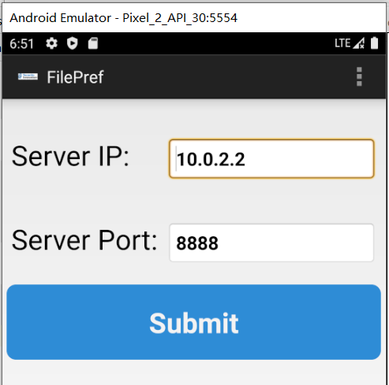

- 使用 `jack/Jack@123$` 或者 `dinesh/Dinesh@123$` 即可登陆成功

    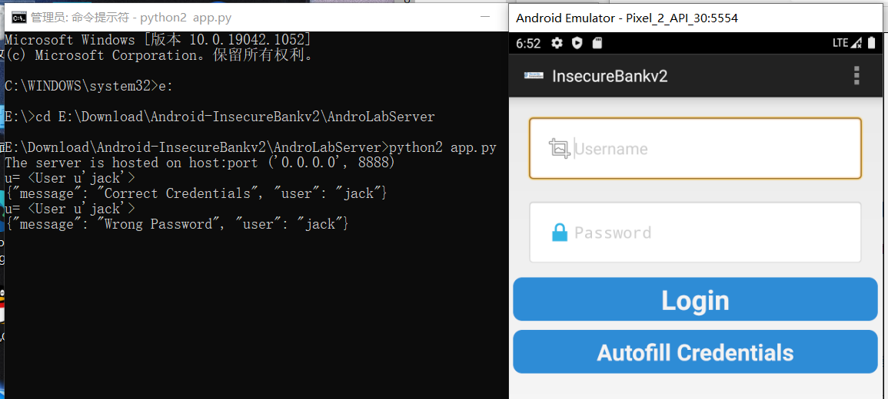

---

### Developer Backdoor

- 根据老师课上视频相关演示，找到如下代码，从而得知后门账户为 `Devadmin`

    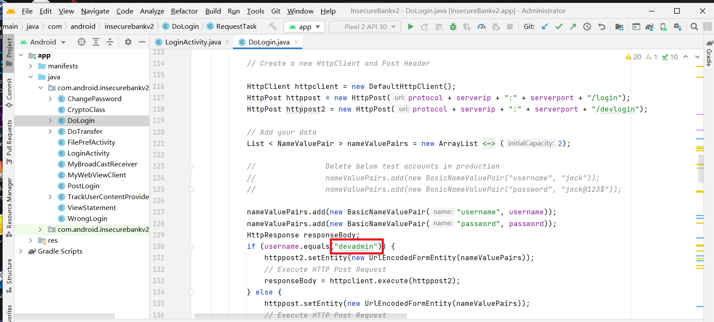

- 使用后门账户时，密码任意即可登录

    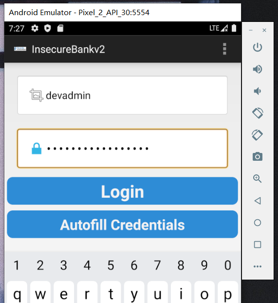

- 登陆成功

    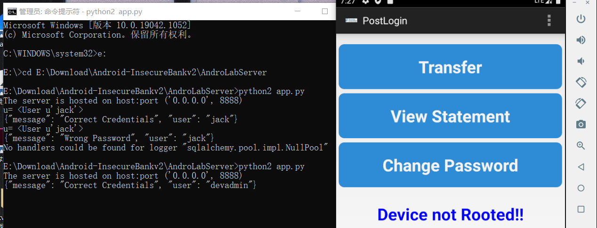

---

### Insecure Logging

- 抓取日志

    ```bash
    adb logcat
    ```

- 使用 `jack/Jack@123$` 登录

    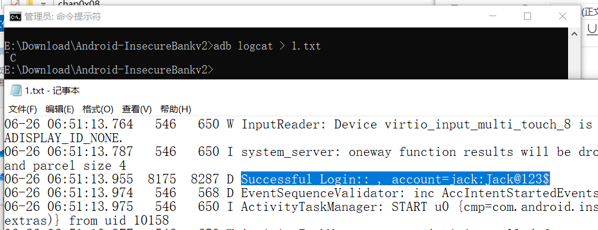

- 进入修改密码界面，将密码修改为 `Jack@123！` ，从日志中能找到对应操作

    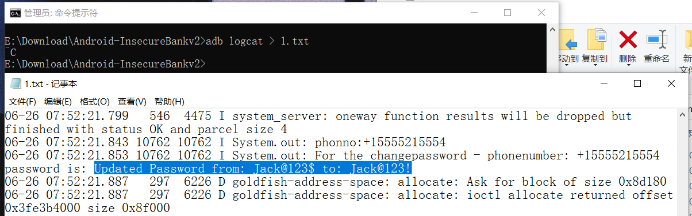

---

### Android Application patching + Weak Auth

- 使用 `VSCode` 的 `APKLab` 对 `apk` 文件进行反编译，反编译过程的输出信息如下：

    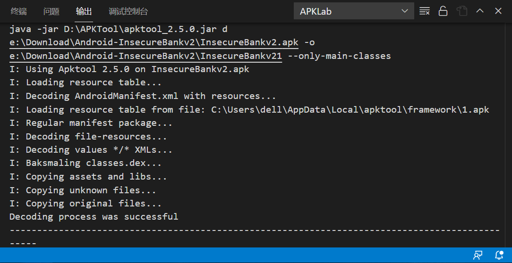

- 在 `InsecureBankv2/res/values` 中找到 `strings.xml` ，修改如下代码：

    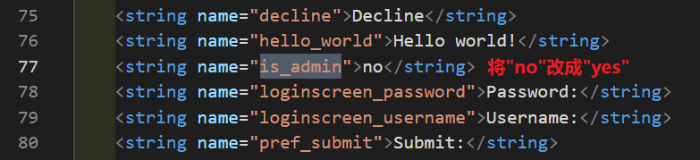

- 使用 `VSCode` 提供的重打包指令进行重打包

    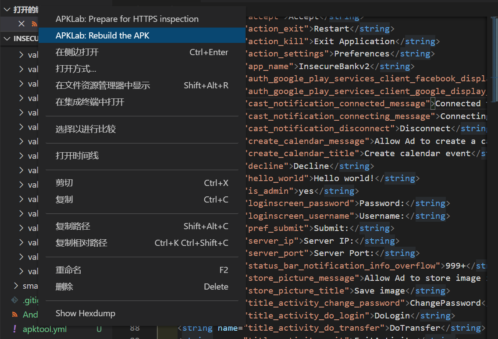

- 重新安装 `InsecureBankv2.apk` ，界面如下，增加了一个添加用户的功能

    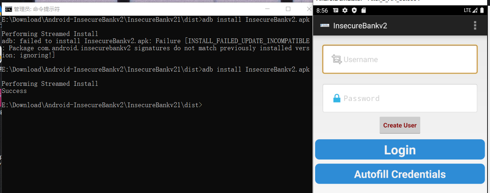

---

### Exploiting Android Broadcast Receivers

- 同上一个实验对 `apk` 文件进行反编译

- 找到反编译后的 `AndroidManifest.xml` 文件，找到如下代码：

    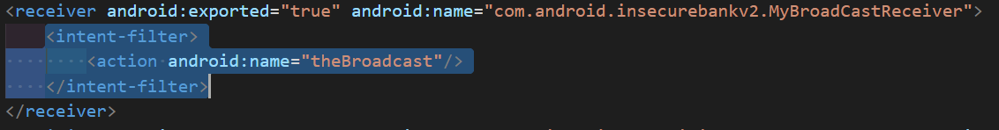

- 对 `InsecureBankv2.apk` 进行逆向操作，提前下载 `dex2jar` 和 `JADX`

    ```bash
    unzip InsecureBankv2.apk

    #将classes.dex文件复制到dex2jar文件夹
    chmod +x d2j-dex2jar.sh
    chmod +x d2j_invoke.sh

    #sh d2j-dex2jar.sh classes.dex
    #此条指令执行失败，查阅资料后改用下条指令
    d2j-dex2jar.bat classes.dex
    ```

    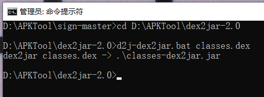

- 用 `JADX` 直接打开 `jar` 文件，找到 `com.android.insecurebankv2.ChangePassword` 和 `com.android.insecurebankv2.MyBroadCastReceiver` 中的代码：

    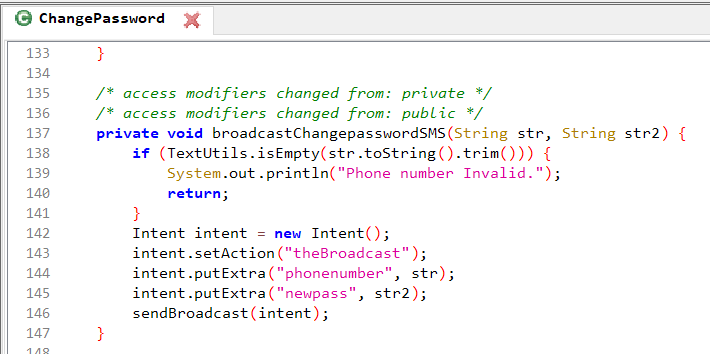

    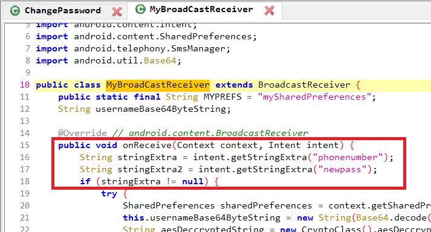

- 将 `InsecureBankv2.apk` 复制到 `Android SDK` 的 `platform-tools` 文件夹下，在模拟器运行时，执行以下命令：

    ```bash
    adb install InsecureBankv2.apk
    ```

- 再次打开 `InsecureBankv2`

- 回到 `platform-tools` 文件夹并在命令行执行以下命令：

    ```bash
    adb shell am broadcast -a theBroadcast -n com.android.insecurebankv2/com.android.insecurebankv2.MyBroadCastReceiver --es phonenumber 5554 –es newpass Dinesh@123!
    ```

    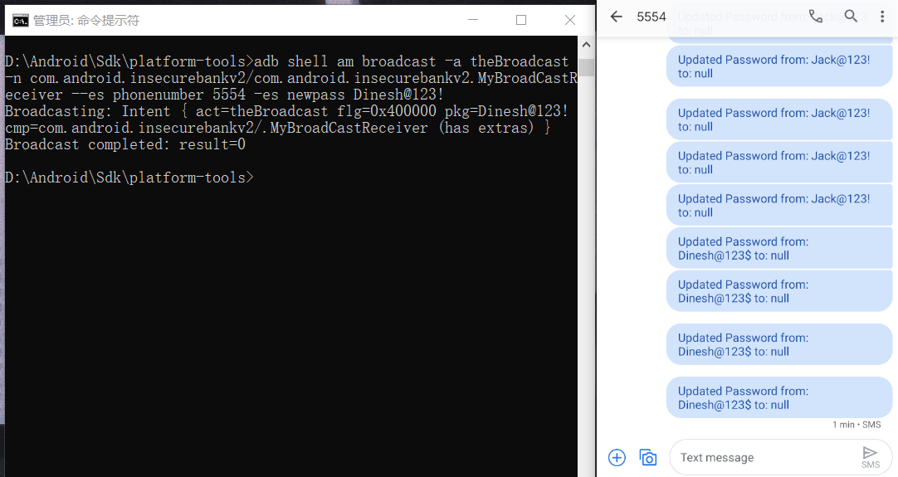

- 收到短信，但不知道为什么密码没有修改成功

---

### Exploiting Android Content Provider

- 使用 `dinesh/Dinesh@123$` 和 `jack/Jack@123$` 先后登陆

- 同上述实验对 `apk` 文件进行反编译，找到反编译后的 `AndroidManifest.xml` 文件，找到如下代码：

    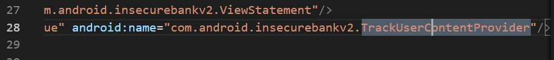

- 同上述实验对 `InsecureBankv2.apk` 进行逆向操作，用 `JADX` 直接打开 `jar` 文件，找到如下代码：

    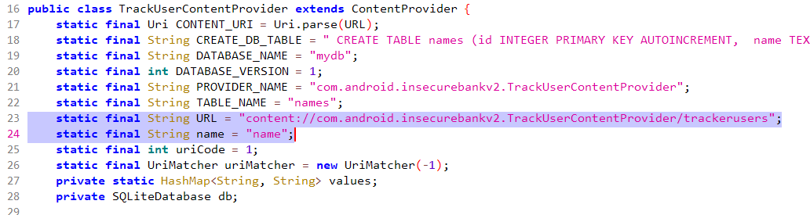

- 将 `InsecureBankv2.apk` 复制到 `Android SDK` 的 `platform-tools` 文件夹下，在模拟器运行时，执行以下命令：

    ```bash
    adb install InsecureBankv2.apk
    ```

- 再次打开 `InsecureBankv2`

- 回到 `platform-tools` 文件夹并在命令行执行以下命令：

    ```bash
    adb shell content query --uri content://com.android.insecurebankv2.TrackUserContentProvider/trackerusers
    ```

- 获得记录

    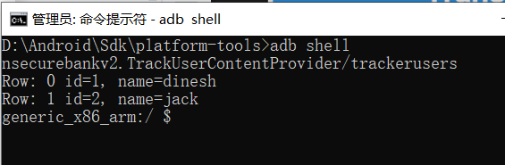

--- 

### Exploiting Android Activities (额外完成)

- 同上述实验对 `apk` 文件进行反编译，找到反编译后的 `AndroidManifest.xml` 文件，找到如下代码：

    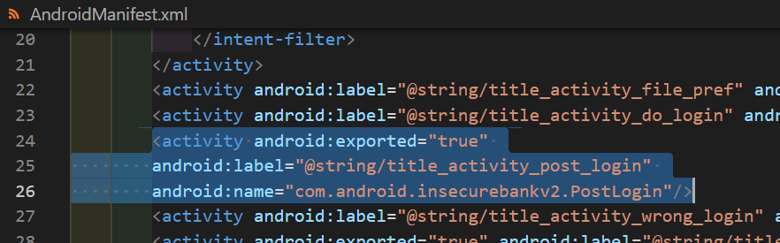

- 将 `InsecureBankv2.apk` 复制到 `Android SDK` 的 `platform-tools` 文件夹下，在模拟器运行时，执行以下命令：

    ```bash
    adb install InsecureBankv2.apk
    ```

- 再次打开 `InsecureBankv2` ，进入未登录界面

    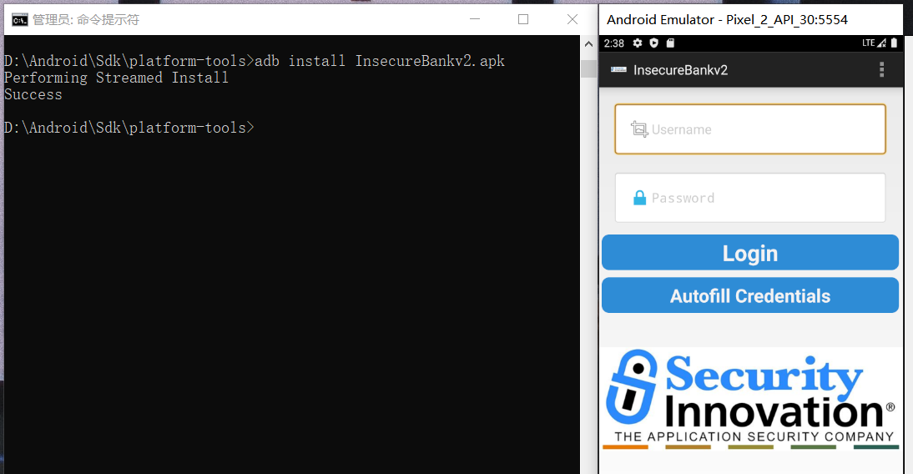

- 回到 `platform-tools` 文件夹并在命令行执行以下命令：

    ```bash
    adb shell am start -n com.android.insecurebankv2/.PostLogin
    ```

- 成功自动登录

    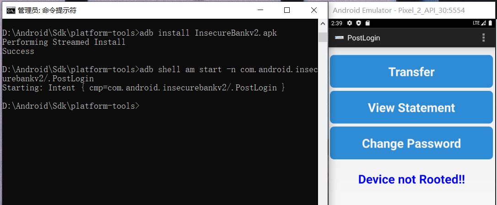

---

### Exploiting Android Pasteboard (额外完成)

- 使用 `dinesh/Dinesh@123$` 登录，登录后进入 `Transfer` 界面

- 输入 `888888888` 并复制到剪贴板

    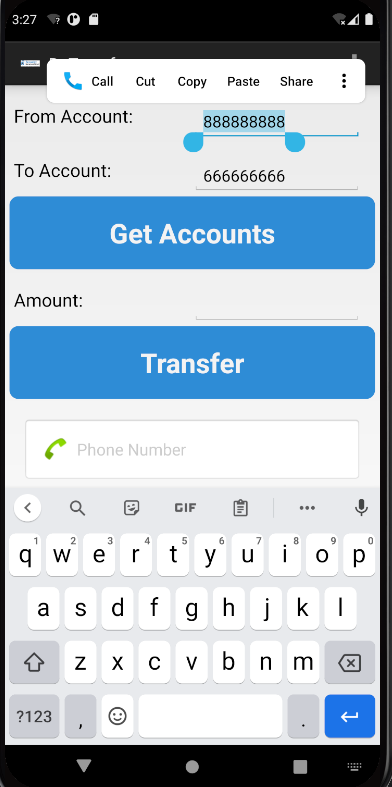

- 回到命令行执行以下命令：

    ```bash
    adb shell ps | grep insecure

    adb shell su u0_a153 service call clipboard 3 s16 com.android.insecurebankv2
    ```

- 获得结果

    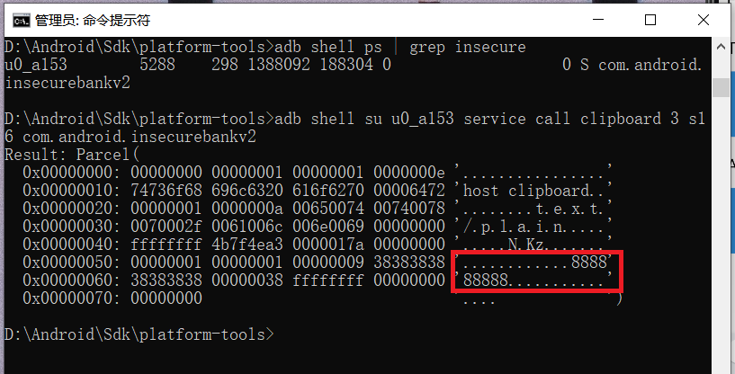

---

### （可选）使用不同于 Walkthroughs 中提供的工具或方法达到相同的漏洞利用攻击效果: 推荐 drozer

#### 1.配置环境

- 从[drozer](https://github.com/mwrlabs/drozer)选择win32 msi文件下载

    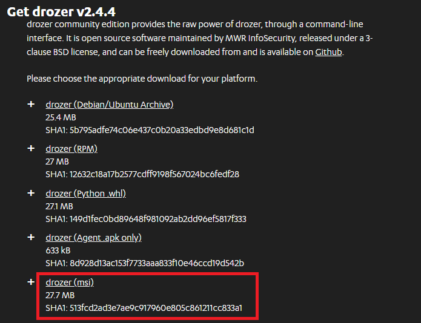

- 安装下载程序包，指定python2.7路径

- 下载手机[agent](https://github.com/mwrlabs/drozer/releases/download/2.3.4/drozer-agent-2.3.4.apk)并安装到模拟器中

    ```bash
    adb install drozer-agent-2.3.4.apk
    ```

    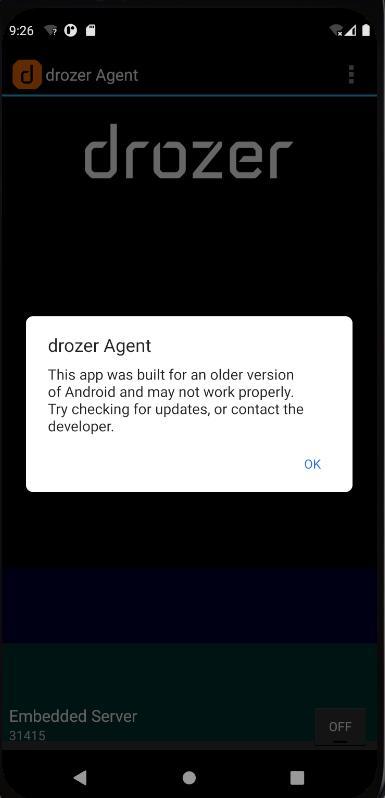

- 转发端口

    ```bash
    adb forward tcp:31415 tcp:31415
    ```

- 连接模拟器

    ```bash
    drozer console connect
    ```

- 上一步连接遇到的大量报错在后续实验问题中阐述，先展示连接成功结果：

    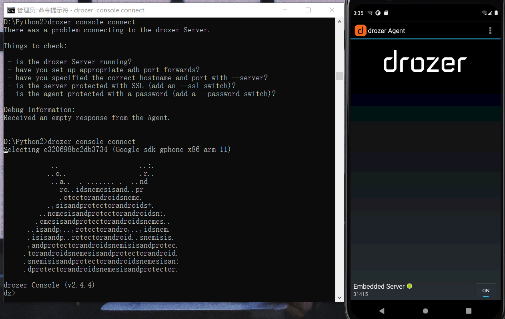

#### 2.使用drozer进行漏洞利用攻击

- 以Exploiting Android Content Provider为例

    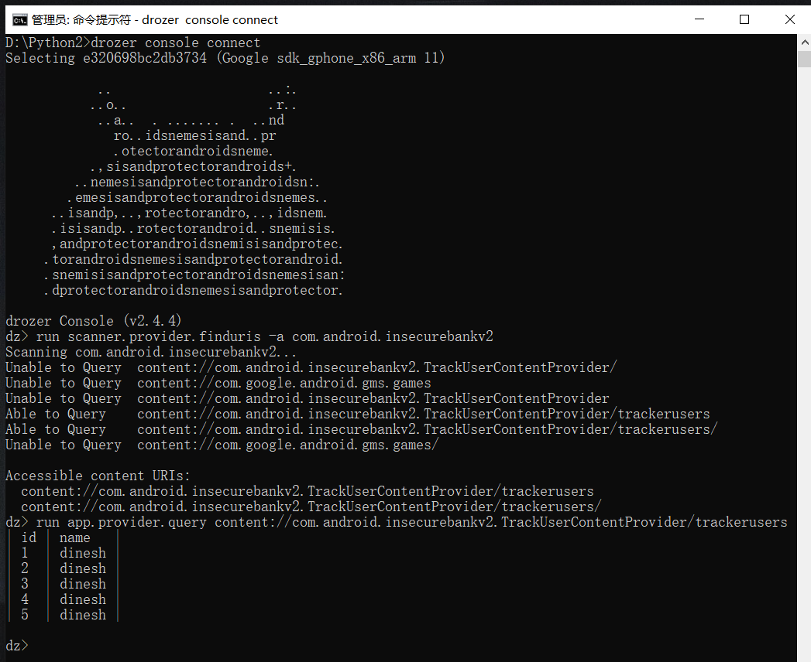

---

## 实验问题

### 1.文档实验遇到的问题

- 报错 `pip Fatal error in launcher: Unable to create process using ...` 

    - python2和3共存出现的问题，将python2的 `python.exe` 改成 `python2.exe`
    - 再用 `python2 -m pip install --upgrade pip` 
- 实验**Exploiting Android Broadcast Receivers**在执行原文档的 `sh d2j-dex2jar.sh classes.dex` 时报错

    - 改用 `d2j-dex2jar.bat classes.dex`

- 实验**Exploiting Android Pasteboard**在执行原文档的 `adb shell su u0_a58 service call clipboard 2 s16 com.android.insecurebankv2` 时先报错 `/system/bin/sh: su: not found`

    - Android Studio带(Google Play)的模拟器无法获得root权限安装，该换成为带(Google APIs)的模拟器即可

- 换了模拟器后还是报错

    - `u0_a58` 要根据自己的结果修改成 `u0_a153`
    - `2` 不可用，改用 `3`
        ```bash
        #static final int TRANSACTION_getClipboardText 1
        #static final int TRANSACTION_hasClipboardText 3
        #static final int TRANSACTION_setClipboardText 2
        ```

---

### 2.drozer实验遇到的问题

- 安装时没有指定python2.7的路径

    - 卸载重装，指定路径

- 执行 `drozer console connect` 时无反应

    - 本机同时安装了python2和3并且python2的 `python.exe` 被改为了 `python2.exe` ，导致drozer找不到python2的环境。将被改名的 `python2.exe` 改回 `python.exe` 就行了。

- 执行 `drozer console connect` 时遇到如下报错

    ```bash
    drozer Server requires Twisted to run.
    Run 'pip install twisted' to fetch this dependency.
    ```

    - 运行 `python -m pip install twisted`


- 执行 `drozer console connect` 时遇到如下报错

    ```bash
    Run ':0: UserWarning: You do not have a working installation of the service_identity module: 'No module named service_identity'.  Please install it from <https://pypi.python.org/pypi/service_identity> and make sure all of its dependencies are satisfied.  Without the service_identity module, Twisted can perform only rudimentary TLS client hostname verification.  Many valid certificate/hostname mappingsmay be rejected.
    ```

    - 运行 `python -m pip install service_identity`

- 执行 `drozer console connect` 时遇到如下报错

    ```bash
    CryptographyDeprecationWarning: Python 2 is no longer supported by the Python core team.
    ```

    - Cryptography模块的版本太新了，python2不支持，改用旧版本

        ```bash
        #卸载cryptography模块
        python -m pip uninstall cryptography
        
        #通过报错查看可用版本号
        python -m pip install cryptography==
        
        #下载cryptography2.8
        python -m pip install cryptography==2.8
        ```

- 执行 `drozer console connect` 时遇到如下报错

    ```bash
    There was a problem connecting to the drozer Server.

    Things to check:

    - is the drozer Server running?
    - have you set up appropriate adb port forwards?
    - have you specified the correct hostname and port with --server?
    - is the server protected with SSL (add an --ssl switch)?
    - is the agent protected with a password (add a --password switch)?

    Debug Information:
    Received an empty response from the Agent.
    ```

    - drozer Agent右下角的按钮没有打开

---

## 参考资料

- [第八章实验](https://c4pr1c3.github.io/cuc-mis/chap0x08/homework.html)

- [移动互联网安全（2021）](https://www.bilibili.com/video/BV1rr4y1A7nz?p=162)

- [python——虚拟环境之pipenv的安装及使用(windows10,64位)](https://www.cnblogs.com/cuizhu/p/9456961.html)

- [解决"pip Fatal error in launcher: Unable to create process using ... "的错误](https://blog.csdn.net/weixin_39278265/article/details/82938270)

- [python：python2与python3共存时，pip冲突，提示Fatal error in launcher: Unable to create process using '"d:\python27\python2.exe" "D:\Python27\Scripts\pip2.exe" '](https://www.cnblogs.com/gcgc/p/11127113.html)

- [Win10环境中如何实现python2和python3并存](https://www.jb51.net/article/191184.htm)

- [webpy](https://github.com/webpy/webpy)

- [找不到d2j-dex2jar怎么解决](https://zhidao.baidu.com/question/1179880039754434939.html)

- [Android 必知必会 - 使用 ADB 操作 Clipboard](https://blog.csdn.net/ys743276112/article/details/79083798)

- [关于/system/bin/sh: su: not found的解决办法（安卓模拟器运行）](https://blog.csdn.net/nity_/article/details/99312414)

- [drozer安装使用教程（Windows）](https://www.cnblogs.com/lsdb/p/9441813.html)

- [Drozer 踩坑](https://blog.csdn.net/weixin_45427650/article/details/116564251)

- [Android 开源安全测试工具 Drozer，安装过程中的问题](https://blog.csdn.net/Jession_Ding/article/details/82528142)

- [Python2-cryptography Download for Linux (rpm, xz, zst)](https://pkgs.org/download/python2-cryptography)

- [Python查看第三方库、包的所有可用版本，历史版本](https://blog.csdn.net/u011519550/article/details/88890382)

- [python第三方库的更新和安装指定版本](https://www.cnblogs.com/mo-nian/p/12334478.html)

- [Android安全性测试框架Drozer运行常见问题](https://blog.csdn.net/weixin_44575660/article/details/116211381)